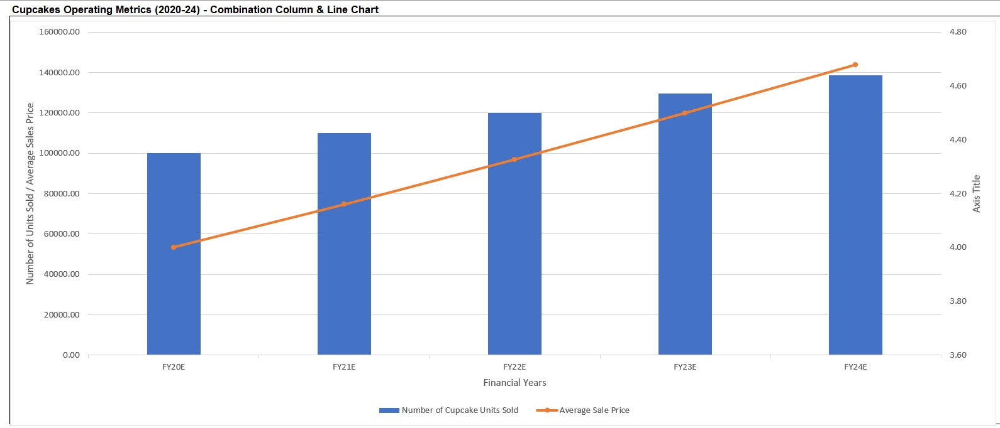

# Goldman Sachs Excel Business Virtual Experience Project

<h2 align="center">  Project Overview </h2>

 Client: The Cupcake Shop

 Client's Industry: Food,  Pastry, Culinary, Marketing and Sales.

### Task 

The Project task was to assist a cupcake shop specializing in baked goods, drinks and icecreams flavours that delivers to both individual customers and other businesses. It was also to understand the client's business problem which involves finding out what their business will look like in 5 years.

The focus of this virtual experience was to:
<ul>
<li>Create forecast operating assumptions (for revenue, costs and cash flow) based of clients file in Excel.</li>
<li>Building profit and loss (P&L) forecast statements using the set of forecast assumptions.</li>
<li>Forecasting cash flow statements.</li>
<li>Create outputs charts in excel.</li>

<h2 align="center"> Project Process </h2>

<li>1. Create forecast operating assumptions
        <ul><li>Operating assumptions for revenue (cupcakes, icecream, drinks), costs and cash flow using .</li> 
        </ul>
    </li>
    
 

 

<li>2. Building profit and loss (P&L) forecast statements
        <ul> 
            <li>translate set of forecasted operating assumptions to P&L statement </li>
            <li> the financial statement shows a company's profit or loss over a particular period(typically a financial year).</li>
            <li>It lays out revenue, direct costs, gross profit, operating expenses, depreciation and amortization(D&A), net interest, taxes, and           net profit in a logical manner. </li>
        </ul>
    </li>
 
 

 

<li>3. Forecasting cash flow statements
        <ul><li>Ensure that the cupcake shop has enough cash to execute its 5-year plan. </li> 
        <li>Forecast the cupcake future cash flows, calculate net cash flow for each year for the business taking into account the operating,                   investing and financing cash flows.</li> 
        <li>Client indicated that any excess cash flow is to be used to pay down debt as opposed to adding to the cash balance. </li> 
        <li>Analyze if client has ensuring cash in the forecast period to continue to pay down its debt and maintain a positive cash balance. </li> 
        <li>Utilize the cash flow assumptions alongside the P&L forecast to complete the cash flow and use the forcast cash flow analysis to                        calculate a closing cash balance for each period. </li> 
        </ul>
        </li>   
  

 

 

 <li>4. Create outputs charts in excel
        <ul><li>to provide visuals for revenue forecast for all products. </li> 
            <li>to provide visuals for cash forecast. </li>
            <li>to provide visuals for debt forecast.</li>
            <li>to provide visuals for cupcake operating metrics.</li>

<h2 align="center"> Visualization </h2>

For last task, I used Excel charts to provide insights for financial years 2020 to 2024 on the cupcake volume, revenue forecast for all products (cupcakes, icecream and drinks), cash forecast, debt forecast. 

The 4 different types of charts created were the:

<li> Column Chart </li>
<li> Line Chart </li>
<li> Area Chart </li>
<li> Combo Chart (Column and Line) </li>

###  Column Chart

###  Line Chart

###  Area Chart

###  Combo Chart

<h2 align="center"> Analysis and Insights </h2>

