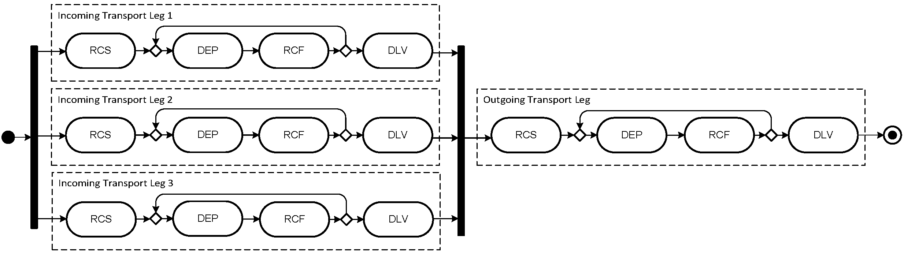

# Prediction and Optimization Logisitic Analysis

---
Prediction models, Optimization, Transportation and Logistic Process 

---

<h2 align="center">  Motivation </h2>

The movement of goods and services from place to place has been of ageless economic importance to both developing and developed nations. This section of human endeavour has called for countless and relentless researches to achieve an optimal performance in any transportation processing. Moreso, the advent of sophisticated technological innovations has set in motion an unending demand to develop predictive models to monitor and optimize transport and logistic processes. 

Our quest is to apply data analytics techniques to discuss the effective analytic methods of monitoring transport and logistic processes as well as to develop an optimal path to predict possible delivery time for a particular transportation leg.

The economic importance of these are: 
<ul>
<li>To salvage up to 15 % of annual expenditure accuring to transportation cost of moving goods by effective management of freight delivery processes(air transportation)</li>
<li>To reduce the $CO_2$ (Carbondioxide) emission accountable to the transportation industry.</li>
<li>To predict the delivery time for a particular freight transportation process.</li>
</ul>

<h2 align="center"> Description of Dataset for CARGO 2000 </h2>

The diagram below shows a model of the business processes covered in the case study. It represents the business processes of a freight forwarding company, in which up to three smaller shipments from suppliers are consolidated and in turn shipped together to customers. The business process is structured into incoming and outgoing transport legs, which jointly aim at ensuring that freight is timely delivered to customers.

Each of the transport legs involves the following physical transport services:
• RCS: Check in freight at departure airline. Shipment is checked in and a receipt is produced at departure airport.
• DEP: Confirm goods on board. Aircraft has departed with shipment on board.
• RCF: Accept freight at arrival airline. Shipment is checked in according to the documents and stored at arrival warehouse.
• DLV: Deliver freight. Receipt of shipment was signed at destination airport.

A transport leg may involve multiple segments (e.g., transfers to other flights or airlines). In those cases, activity RCF loops back to DEP (indicated by the “loop-back” arrow in Figure 1). In the case study, the number of segments per leg ranges from one to four.

The transport services are denoted by three-letter acronyms according to the Cargo 2000 industry standard. Cargo 2000 is an initiative of IATA, the International Air Transport Association (Cargo 2000 has been re-branded as Cargo iQ in 2016). It aims at delivering a new quality management system for the air cargo industry. Cargo 2000 allows for unprecedented transparency in the supply chain. Stakeholders involved in the transport process can share agreed Cargo 2000 messages, comprising transport planning, replanning and service completion events. Cargo 2000 is based on the following key principles: (1) Every shipment gets a plan (called a route map) describing predefined monitoring events. (2) Every service used during shipment is assigned a predefined milestone with a planned time of achievement. (3) Stakeholders receive alerts when a milestone has failed and notifications upon milestone completion, which include the effective time the milestone has been achieved.

<b>The case study data comprises tracking and tracing events from a forwarding company’s Cargo 2000 system for a period of five months. From those Cargo 2000 messages, we reconstructed execution traces of 3,942 actual business process instances, comprising 7,932 transport legs and 56,082 service invocations. Each execution trace includes planned and effective durations (in minutes) for each of the services of the business process (introduced in Section II), as well as airport codes for the DEP (“departure”) and RCF (“arrival”) services. Due to the fact that handling of transport documents along the business process differs based on whether the documents are paper-based or electronic, we focus on the flow of physical goods, as our data set did not allow us to discern the different document types.</b>

The reconstruction process involved data sanitation and anonymization. We filtered overlapping and incomplete Cargo 2000 messages, removed canceled transports (i.e., deleted route maps), sanitized for exceptions from the C2K system (such as events occurring before route map creation) and homogenized the way information was represented in different message types. Finally, due to confidentiality reasons, message fields which might exhibit business critical or customer-related data (such as airway bill numbers, flight numbers and airport codes) have been eliminated or masked. <b> source: S-CUBE</b>

<h2 align="center"> TABLE OF CONTENT </h2>
<ol>
    <li>Motivation</li>
    <li>Introduction</li>
    <li>Description of the Data Set</li>
    <li>Data Cleaning</li>
    <li>Exploratory Analysis of each Segment Labels</li>
    <li>Detailed Analysis on Leg 1
        <ul><li>Segment 1<ul><li>Logistic Regression Analysis on Segment 1, Leg 1 (Supervised Learning)</li> <li>Linear Regression Analysis of Segment 1, Leg 1 (Supervised Learning)</li><li>Detailed Analysis of Seg. 1, LEG. 1, (UnSupervised Learning)</li></ul>
            </li>
            <li>Segment 2<ul> <li>Logistic Regression Analysis on Segment 2, Leg 1 (Supervised Learning)</li><li>Linear Regression Analysis of Segment 2, Leg 1 (Supervised Learning)</li><li>Detailed Analysis of Seg. 1, LEG. 1, (UnSupervised Learning)</li></ul>
            </li>
            <li>Segment 3<ul> <li>Third Segment Leg 1, Using Random Decision Forest (Ensembling Learning)</li></ul>
            </li>
        </ul>
    </li>
    <li>Conclusion On the Analysis of Leg 1</li>
</ol>

